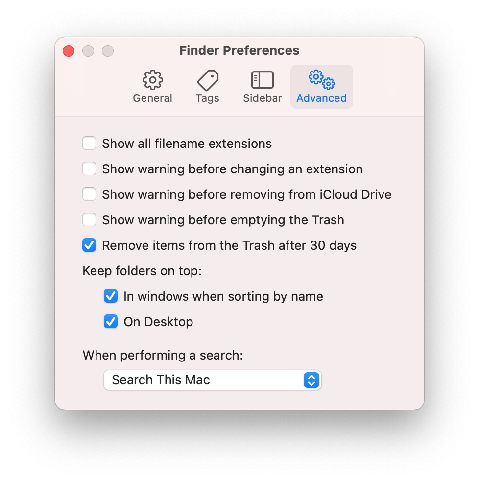

# macOS Setup

## Install apps

Install these apps:

* [iTerm2](http://www.iterm2.com/)
* [VS Code](https://code.visualstudio.com/)
* [Chrome](https://www.google.com/intl/en/chrome/browser/)
* [Docker](https://docs.docker.com/engine/install/)
* [1Password](https://1password.com/)
* [Homebrew](http://brew.sh/)
* [Go](https://go.dev/dl/)
* [Node.js](https://nodejs.org/en/)
* [NordLocker](https://nordlocker.com/download/mac/)
* [Scroll Reverser](https://pilotmoon.com/scrollreverser/)

Install these apps from the App Store:

* [Simplenote - Notes and Memos](https://apps.apple.com/ca/app/simplenote-notes-and-memos/id692867256?mt=12)
* [Xcode](https://apps.apple.com/ca/app/xcode/id497799835?mt=12)
* [1Password for Safari](https://apps.apple.com/ca/app/1password-for-safari/id1569813296?mt=12)
* [VPN for privacy | NordVPN](https://apps.apple.com/ca/app/vpn-for-privacy-nordvpn/id905953485)

Type `git` in the terminal - this will install developer tools.

## Configuration

## Scroll Reverser

TBD

### Finder

Open `Finder`

Open `Preferences` → `General`

* `New Finder windows show` → select home directory

Open `Preferences` → `Advanced`



### Contacts

Open `Contacts`

Open `Preferences` → `General`

* `Sort By` → select `First Name`

Open `File` → `New Smart Group` → Card/is not member of/any group.

### System preferences

Open `System Preferences`

Open `Keyboard` → `Keyboard`

* Enable `Use F1, F2, etc. keys as standard function keys`
* `Key repeat` - set to the fastest setting

Open `Keyboard` → `Input Sources`

* Add `Russian - PC`

Open `Keyboard` → `Text`

* Disable `Correct spelling automatically`
* Disable `Capitalize words automatically`
* Disable `Add a period with double-space`

Open `Dock & Menu Bar`

* `Minimize windows using` → set `Scale effect`
* Enable `Minimize windows into application icon`
* Enable `Automatically hide and show the Dock`

Open `Software Update`

* Enable `Automatically keep my Mac up to date`

Open `Touch ID`

* Add fingerprint

### Setup VS Code

* Launch VS Code
* Open the Command Palette [Cmd + Shift + P] and type `Install 'code' command in PATH`

### Configure Docker

* Run Docker
* Open `Preferences` → `General` → enable `Start Docker Desktop when you log in`
* Open `Preferences` → `Software updates` → enable `Always download updates`

### Configure kubectl

Save kubeconfig

```bash
mkdir ~/.kube
nano ~/.kube/config
chmod 600 ~/.kube/config
```

## Setup/Configuration Part 2

Run

```bash
sudo su
USERNAME="[username]"
echo "$USERNAME ALL=(ALL) NOPASSWD: ALL" >> /etc/sudoers
```

Create a key with

```bash
EMAIL="[email]"
ssh-keygen -t rsa -C "$EMAIL" -N ""
cat ~/.ssh/id_rsa.pub
```

Add key on the GitHub [SSH and GPG keys settings page](https://github.com/settings/keys)

Then run

```bash
git clone git@github.com:desecho/macos-setup.git
cd macos-setup
```

To configure VS Code run

```bash
make configure-vs-code
```

To install [Oh My Zsh](https://github.com/robbyrussell/oh-my-zsh) run

```bash
make install-oh-my-zsh-1
make install-oh-my-zsh-2
```

To install Homebrew packages run

```bash
make install-brew-pkgs
```

To install Python packages run

```bash
make install-python-pkgs
```

To install Ansible run

```bash
make install-ansible
```

Then you need to configure the variables in `ansible/vars.yml`.

You might also want to change variables in `ansible/roles/main/defaults/main.yml`.

Then run

```bash
make provision
```
